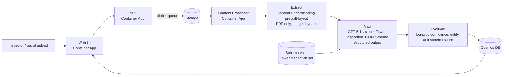

# Extending the Content Processing Gold Standard to Tower Inspection

The [CSA Gold Standard — Content Processing solution accelerator](https://aka.ms/CSAGoldStandards/ContentProcessing) ships with an **Auto Claim** collection (claim form, police report, repair estimate and damaged-vehicle photos). This asset shows how to extend the same deployment to a completely different industry: **transmission tower inspection** for power utilities. A tower photograph goes in. A structured, evidence-linked assessment comes out. It covers six anomaly classes on a three-level severity scale, with normalized bounding boxes and a work-order recommendation.

The pipeline code doesn't change. The extension is one new JSON Schema plus one new schema set, registered against the live API. Everything else (queueing, multimodal extraction with GPT-5.1 in Azure AI Foundry, confidence scoring, Cosmos DB persistence, the review UI) is reused as-is.


*One claim, twelve tower photographs, each scored against the `TowerInspectionImageAssessment` schema. Entity and schema scores range from 72% to 93%.*

## Why tower inspection

Utilities patrol thousands of structures by drone, helicopter and ground crew. The photos pile up faster than engineers can review them, and the findings end up as free text that can't be ranked, joined to asset records or tracked over time. The business needs are:

- **Triage at scale.** Rank structures by worst finding so crews go to the riskiest towers first.
- **A join key.** Read the tower ID from the nameplate so findings link to maintenance history, telemetry and weather.
- **No false confidence.** Reject dark, blurred or obstructed photos instead of guessing.
- **Traceability.** Every finding points back to the source media, a location in the frame and the reasoning behind it.

## What changes versus the gold standard

| Layer | Gold standard (Auto Claim) | Tower Inspection extension | Code change? |
| --- | --- | --- | --- |
| Schema | 4 JSON Schemas (claim form, police report, repair estimate, damaged vehicle image) | 1 JSON Schema: `TowerInspectionImageAssessment` | No (data only) |
| Collection | `Auto Claim` schema set | `Tower Inspection` schema set | No (registered through `/schemavault` and `/schemasetvault`) |
| Ingestion, queueing, Map/Evaluate pipeline | Shared | Shared | No |
| Review UI | Shared | Shared, with a new collection in the dropdown | No |
| Registration | `register_schema.py schema_info.json` | `register_schema.py tower_inspection/schema_info.json` | No |



> **How Content Understanding fits.** In the accelerator, Azure AI Content Understanding (`prebuilt-layout`) handles document extraction, such as PDF patrol reports or work orders. Image files skip the Extract step and go directly to the Map step, where GPT-5.1 vision fills the JSON Schema through structured output. The Process Steps screenshot below shows Extract at 0.00s for this reason. For images, the Evaluate step scores confidence from the model's token log-probabilities, so the entity score and schema score are identical.

## Deploy and register

```bash
# 1. Deploy the gold-standard accelerator (about 15-35 minutes)
azd up

# 2. Register the Auto Claim samples plus the new Tower Inspection collection
cd src/ContentProcessorAPI/samples/schemas
python register_schema.py https://<api-fqdn> schema_info.json
python register_schema.py https://<api-fqdn> tower_inspection/schema_info.json
```

`tower_inspection/schema_info.json` is a short manifest:

```json
{
  "schemas": [
    { "File": "towerinspectionimage.json", "ClassName": "TowerInspectionImageAssessment", "Description": "Tower Inspection Image Assessment" }
  ],
  "schemaset": { "Name": "Tower Inspection", "Description": "Transmission tower inspection schema set — six-class anomaly detection with three-level severity scoring and an evidence chain" }
}
```

After registration, **Tower Inspection** appears in the collection picker and the import dialog accepts JPEG and PNG tower photographs against it.


## The Tower Inspection schema explained

The schema ([`towerinspectionimage.json`](https://github.com/jon-soong-msft/content-processing-tower-inspection/blob/main/schema/towerinspectionimage.json)) is a standard JSON Schema document. The pipeline passes it to the model as a structured-output contract, so every field description is also an instruction to the model.

### Three rules the schema enforces

1. **Evidence first.** Every finding must trace back to a source media reference and, where visible, a capture timestamp. An unattributed inference is a defect.
2. **Filter, don't guess.** Media that is too dark, too distant, obstructed or badly framed is reported as unusable and isn't scored.
3. **No commercial content.** Cost, budget, repair estimates and contractor pricing are out of scope and must never appear in any field.

### Two authoring patterns worth reusing

- **Reason before concluding.** Each decision block starts with a mandatory `*_reasoning` field (`identification_reasoning`, `spatial_reasoning`, `quality_reasoning`, `class_reasoning`, `severity_reasoning`). These fields list the questions the model must answer, in order. Structured output generates properties in declaration order, so the reasoning is written *before* the label it justifies.
- **Gate before scoring.** The `media_quality` block comes before `anomalies`. If `is_usable` is `false`, `anomalies` must be empty and the outcome is `filtered-unusable-media`.

### Top-level structure

| Block | Purpose | Key fields |
| --- | --- | --- |
| `asset_identification` | Who is this structure? The tower ID is the **join key** to maintenance history, telemetry and weather. | `tower_id` (must be **null** unless legible; never inferred), `tower_id_source`, `nameplate_text` (verbatim OCR), `structure_type`, `circuit_designation` |
| `capture_context` | What can legitimately be concluded from this viewpoint? | `view_angle` (8 values, e.g. `ground-level-oblique`, `aerial-overhead`, `cross-arm-close-up`), `distance_band` (`close` / `mid` / `far`) |
| `media_quality` | Usability gate applied **before** scoring. | `is_usable`, `unusable_reasons[]` (`low-light`, `motion-blur`, `weather-obscured`, `excessive-distance`, `lens-contamination`, …), `lighting`, `obstruction`, `framing` |
| `anomalies[]` | One entry per distinct finding. | See the per-detection fields below. |
| `overall_assessment` | Roll-up for triage and ranking. | `anomaly_count`, `highest_severity`, `classes_present[]`, `structural_risk_summary`, `requires_work_order`, `inspection_outcome` (`clear` / `anomalies-detected` / `filtered-unusable-media`) |
| `evidence` | Attribution payload. | `source_media_reference`, `media_kind` (`still-image` / `video-frame`), `capture_timestamp` (as burned into the media; never the processing time), `frame_reference`, `visible_text_evidence` |

### Anomaly taxonomy (exactly six classes; the model must not invent a seventh)

| `anomaly_class` | Definition in the schema | `recommended_action` observed in this run |
| --- | --- | --- |
| `corrosion` | Metal loss, rust bloom, scaling or section loss on members, cross-arms or fittings | `schedule-inspection` (medium) |
| `vegetation-encroachment` | Growth advancing into the right of way or toward conductors | `dispatch-clearing-crew` (required by the schema) |
| `structural-tilt` | Lean, twist, buckling or deformation relative to vertical | `enhanced-monitoring` (required by the schema for high severity) |
| `missing-hardware` | Absent bolts, nuts, plates, step bolts, dampers or fittings versus the expected symmetric configuration | none (not present in the test pack) |
| `bird-nesting` | Nests or nesting material on a live structure | `schedule-inspection` (medium) |
| `foreign-object` | Storm debris, wind-blown material, kites, netting or sheeting lodged on the structure | `immediate-intervention` (high), `schedule-inspection` (medium) |

### Severity scale (applied consistently across all six classes)

| `severity` | Meaning |
| --- | --- |
| `low` | Cosmetic or early-stage; no effect on integrity or clearance. Monitor on the normal cycle. |
| `medium` | Established condition on a load-bearing or clearance-critical element that will worsen without intervention. Schedule work. |
| `high` | Integrity or clearance is compromised now, or the condition is advanced enough to warrant enhanced monitoring or immediate attention. |

### Per-detection fields (`anomalies[]`)

| Field | Why it exists |
| --- | --- |
| `detection_id` | Stable ID (`D1`, `D2`, …) that ties the finding to its box and to the risk summary |
| `class_reasoning` → `anomaly_class` | Describe what is visible first, then classify |
| `component` | Where the anomaly sits: `cross-arm`, `tower-leg`, `bracing-member`, `insulator-string`, `conductor`, `foundation-or-base`, `right-of-way`, … |
| `description` | Factual description of what is visible at the location |
| `severity_reasoning` → `severity` → `severity_criteria` | Reason, decide, then state the single decisive criterion in one sentence |
| `confidence` | 0.0 to 1.0, honest. Distant or occluded observations must carry lower confidence. |
| `bounding_box` | Normalized `x_min`, `y_min`, `x_max`, `y_max` in [0..1]. Null only for whole-structure properties such as tilt. |
| `progression_indicator` | `early-stage` / `established` / `advanced` / `not-assessable`, for tracking a structure across re-inspections |
| `recommended_action` | Operational routing hint only (`monitor-next-cycle`, `schedule-inspection`, `dispatch-clearing-crew`, `enhanced-monitoring`, `immediate-intervention`). Never cost or pricing. |

## Walkthrough: critical use cases

> In the screenshots below, the **red outlines and labels** on the JSON panel and the **colored boxes on the source image** were added for this write-up. The boxes are drawn from the model's own `bounding_box` output (orange = medium, red = high). The stock UI shows the same data as JSON.

### 1. Bird nesting: four detections, each localized

Four separate nests are found on the cross-arms. Each has its own `detection_id`, `component: cross-arm`, `severity: medium` (established nest next to energized conductors) and a normalized bounding box that lands on the nest.


### 2. Vegetation encroachment and foreign object: multi-class, high severity

A storm-damaged distribution line yields **three classes in one frame**: `structural-tilt` (D1, whole pole, so `bounding_box: null` by design), `vegetation-encroachment` (D2, routed to `dispatch-clearing-crew`) and `foreign-object` (D3, a broken limb lodged in the span, routed to `immediate-intervention`). All three are `high`.


The roll-up turns these into a triage decision: `highest_severity: high`, `classes_present` lists all three, `requires_work_order: true`, and the `structural_risk_summary` references each finding by detection ID.


### 3. Structural tilt: leaning poles after a storm

Leaning wood distribution poles beside a drainage channel score `structural-tilt / high` (0.96 confidence, `enhanced-monitoring`). A separate `foreign-object / medium` finding covers grass and debris caught on the downed conductors.


### 4. Corrosion on a close-up

A close-up of a lattice leg scores `corrosion / medium` on `tower-leg`. The `severity_criteria` names the decisive factor: established surface corrosion across a primary load-bearing leg and its connections, with no major section loss visible yet.


### 5. Asset identification: OCR without guessing the join key

The same close-up shows why the schema separates `nameplate_text` from `tower_id`. Every legible sign is transcribed verbatim (line directions, substation names, the *Hochspannung Lebensgefahr* warning). But none of these signs is a structure number, so `tower_id` stays **null** and `tower_id_source` is `not-visible`. A guessed ID would silently corrupt the join to asset records.


### 6. Distant, low-contrast view: still detected, honestly framed

From far away against an overcast sky, the model records `distance_band: far` and `structure_type: h-frame`, and still localizes the stork nest on the cross-arm with a tight bounding box.


### 7. Media quality gate: filter, don't guess

A motion-blurred frame fails the gate: `is_usable: false`, `unusable_reasons: ["motion-blur"]`. The `anomalies` array is **empty**, `highest_severity: none`, `requires_work_order: false` and `inspection_outcome: filtered-unusable-media`. The low-light (`low-light`) and haze (`weather-obscured`, `out-of-focus`) test images were also filtered. A blurry photo can't produce a low-confidence "finding" that looks like real evidence.


### 8. Negative control: no false positives

A broadcast mast on a building roof is a lattice structure but not a power-line asset. No anomalies are raised and `inspection_outcome` is `clear`. See backlog item 3 for the `structure_type` label.


### 9. Pipeline trace

The Process Steps tab shows where the time goes for an image: Extract is skipped (0.00s), Map (GPT-5.1 vision with the schema) takes about 36s, and Evaluate is sub-second.


## Results across the 12-image test pack

| Image | Score | Outcome | Anomalies (class / severity) |
| --- | --- | --- | --- |
| 01-clear-baseline | 72% | clear | none |
| 02-corrosion-and-nameplate-closeup | 90% | anomalies-detected | corrosion / medium |
| 03-structural-tilt-collapse | 82% | anomalies-detected | structural-tilt / high |
| 04-structural-tilt-leaning-poles | 90% | anomalies-detected | structural-tilt / high, foreign-object / medium |
| 05-bird-nesting | 93% | anomalies-detected | 4 × bird-nesting / medium |
| 06-vegetation-and-foreign-object | 90% | anomalies-detected | structural-tilt / high, vegetation-encroachment / high, foreign-object / high |
| 07-distant-low-contrast | 85% | anomalies-detected | bird-nesting / medium |
| 08-negative-broadcast-mast | 80% | clear | none |
| 09-unusable-low-light | 77% | filtered-unusable-media | none (gated) |
| 10-unusable-motion-blur | 77% | filtered-unusable-media | none (gated) |
| 11-unusable-weather-obscured | 78% | filtered-unusable-media | none (gated) |
| 12-partial-framing | 82% | anomalies-detected | structural-tilt / high (false positive, see backlog item 4) |

All 12 images processed in one claim in about 8.7 minutes end to end, at 29-62s per image, on a `GlobalStandard` GPT-5.1 deployment in Southeast Asia. Eleven of the twelve outcomes match the expected result. The schema's quality gate and negative control behaved as designed.

## What we learned: the extension backlog

The schema-only extension works. Taking it to production would mean fixing a few places where the gold standard still assumes an auto-claim domain, plus some schema tuning:

| # | Observation | Where | Suggested change |
| --- | --- | --- | --- |
| 1 | The Map step's system prompt for images contains **vehicle-damage rules** (vehicle count, driver-side left/right). The tower schema still works because its field descriptions carry the domain logic, but the prompt is noise for any non-vehicle image. | `src/ContentProcessor/src/libs/pipeline/handlers/map_handler.py` | Make the image instructions schema-driven: generic base rules plus an optional per-schema instruction block stored with the schema. |
| 2 | The claim-level **AI Summary and AI Gap Analysis** prompts are written for auto insurance. For a tower claim the summary declines ("not an auto insurance claim"). | `src/ContentProcessorWorkflow/src/steps/summarize/prompt/` and `.../gap_analysis/prompt/` | Store summary and gap-rule prompts per schema set, e.g. "patrol summary ranked by `highest_severity`" and "missing nameplate, so tower ID unresolved". |
| 3 | The negative-control mast is correctly `clear`, but `structure_type` is reported as `lattice-tower` because the enum has no out-of-scope value. | `towerinspectionimage.json` | Add `non-transmission-structure` to `structure_type` and an in-scope check to the gate, so non-assets are filtered rather than scored. |
| 4 | `12-partial-framing` is a crop of `01-clear-baseline` (which scored `clear`), yet it was scored `structural-tilt / high`. The perspective from the cropped frame was read as a lean. | `towerinspectionimage.json` | Allow `structural-tilt` only when `framing` is `full-structure` or a vertical reference is visible; otherwise set `progression_indicator: not-assessable` and cap severity. Add this crop to a regression set. |
| 5 | Content Understanding is bypassed for images today. | `extract_handler.py` | For drone **video**, add a Content Understanding video analyzer to extract keyframes and timestamps that feed `evidence.frame_reference` and `capture_timestamp`. Patrol PDFs already flow through `prebuilt-layout`. |
| 6 | Registration in the `azd up` post-provision hook ran before the API image was deployed, so schemas had to be registered by hand. | `infra/scripts/post_deployment.ps1` | Register schemas after `deploy` (a `postdeploy` hook), and include `tower_inspection/schema_info.json`. |

## Resources

- CSA Gold Standard: [Content Processing solution accelerator](https://aka.ms/CSAGoldStandards/ContentProcessing)
- Schema, manifest and screenshots: [jon-soong-msft/content-processing-tower-inspection](https://github.com/jon-soong-msft/content-processing-tower-inspection)
- [Azure AI Content Understanding documentation](https://learn.microsoft.com/azure/ai-services/content-understanding/overview)
- [Structured outputs in Azure OpenAI](https://learn.microsoft.com/azure/ai-foundry/openai/how-to/structured-outputs)

## Image credits

The test photographs come from Wikimedia Commons and are used under their respective licenses. Images 09-12 are derived test fixtures created from image 01.

| File | Author | License | Source |
| --- | --- | --- | --- |
| 01-clear-baseline (and derived 09-12) | Daniel Oines | CC BY 2.0 | [Commons](https://commons.wikimedia.org/wiki/File:Electricity_pylons_230_kV_500_kV_Pasco_County_Florida_US_2014.jpg) |
| 02-corrosion-and-nameplate-closeup | Ikar.us | CC BY 3.0 DE | [Commons](https://commons.wikimedia.org/wiki/File:UW_Enzberg_Mastbeschriftung.jpg) |
| 03-structural-tilt-collapse | National Weather Service | Public domain | [Commons](https://commons.wikimedia.org/wiki/File:Houston_derecho_collapsed_transmission_towers_damage.jpg) |
| 04-structural-tilt-leaning-poles | Liz Roll (FEMA) | Public domain | [Commons](https://commons.wikimedia.org/wiki/File:FEMA_-_38497_-_A_lineman_checks_downed_power_lines_in_Texas.jpg) |
| 05-bird-nesting | KaiBorgeest | CC BY 4.0 | [Commons](https://commons.wikimedia.org/wiki/File:Mainz_Laubenheimer-Bodenheimer_Ried_Stork_Pylon.jpg) |
| 06-vegetation-and-foreign-object | Jacinta Quesada (FEMA) | Public domain | [Commons](https://commons.wikimedia.org/wiki/File:FEMA_-_37927_-_Tree_entangled_in_a_power_line_in_Louisiana.jpg) |
| 07-distant-low-contrast | rheins | CC BY 3.0 | [Commons](https://commons.wikimedia.org/wiki/File:%E4%B8%9C%E6%96%B9%E7%99%BD%E9%B9%B3%E5%B7%A2_-_Nest_of_Oriental_Stork_-_2012.06_-_panoramio.jpg) |
| 08-negative-broadcast-mast | SugarMash | CC0 | [Commons](https://commons.wikimedia.org/wiki/File:Tower_of_Power_Transmitter_-_Tandang_Sora,_Culiat,_Quezon_City.jpg) |
